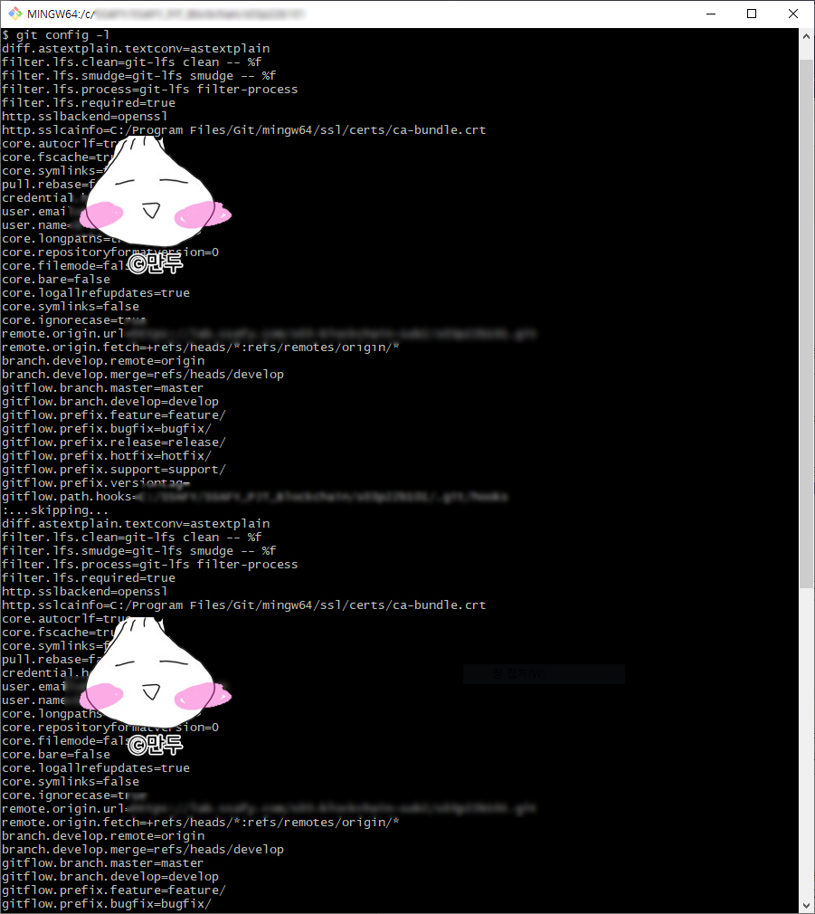

>## git config
`git config`라는 도구로 **설정 내용을 확인하고 변경**할 수 있다.
- ##### 참고사이트: [1.6 시작하기 - Git 최초 설정](https://git-scm.com/book/ko/v2/%EC%8B%9C%EC%9E%91%ED%95%98%EA%B8%B0-Git-%EC%B5%9C%EC%B4%88-%EC%84%A4%EC%A0%95)
```bash
# 내용 확인
git config -l

# 이름 변경
git config --global user.name "NAME"
--global은 전체 프로젝트에 적용하고 싶을 때 사용한다.
```

<br>

`git config -l`한 결과
