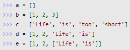
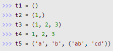

> ## iterable 자료형
### **`iterable`** 의 의미는?
- `iterable`은 `반복 가능한`, 우선 반복할 수 있는 객체
  - 객체: Python에서 사용되는 모든 자료형
- Python의 대표적인 `iterable` 자료형은 **List, Tuple, Dictionary, Set**
- 쉽게 말해서, index로 접근이 가능한 객체들을 의미한다고 볼 수 있~~는 것 같~~다.

<br>

> ## List(리스트)
흔히 알고 있는 `배열` 형태의 자료형이라고 생각하면 될 것 같다.
- 선언 방법

👆🏻출처: https://wikidocs.net/14
<br><br>

- `리스트`는 원소의 개수가 0인, 즉, 비어 있는 리스트(`[]`) 일 수 있다.
  - 비어 있는 리스트를 선언하는 또다른 방법:
    ```bash
    a = list()
    ```
- 어떤 타입의 요소든 함께 가지는 것이 가능하다. (숫자, 문자열 등 혼재 가능)
- **요소의 값을 수정하거나 삭제할 수 있다.**
  - 따라서 값의 변경이 있을 경우 `리스트`를 사용해야 한다.

<br>

> ## Tuple(튜플)
`리스트`와 유사하면서도, 값을 수정하거나 삭제할 수 없는 자료형
- 선언 방법

👆🏻출처: https://wikidocs.net/14
<br><br>

- `t2`: 1개의 요소를 가질 때는 **반드시 요소 뒤에 `콤마(,)`를 붙여야** 한다.
  - 호기심에 콤마를 붙이지 않고 타입을 출력해 보니 `int`라고 나온다.
    ```bash
    t2 = (1)
    print(t2)
    print(type(t2))

    출력값:
    1
    <class 'int'>
    ```
  - 설명 대로, `콤마(,)`를 붙이고 다시 같은 코드를 실행시켜 보았다. 그제서야 `tuple` 타입으로 인정받을 수 있었다.
    ```bash
    t2 = (1)
    print(t2)
    print(type(t2))

    출력값:
    (1,)
    <class 'tuple'>
    ```
- `t4`: 괄호를 생략해도 된다.
  - 직접 실행해 보니 잘 된다. 숫자와 문자열을 혼재해서 입력해도 말이다!
- `리스트`와 마찬가지로 `튜플` 또한 어떤 타입의 요소든 함께 가지는 것이 가능하다. (숫자, 문자열 등 혼재 가능)
- `리스트`와 유사한 측면이 많지만, 가장 큰 차이점은 **수정과 삭제가 불가능**하다는 것이다.
  - 따라서 `값을 절대로 변화시켜서`는 안되는 경우에 튜플을 사용할 수 있다.
  - 그 외의 점들은 리스트와 완전히 동일하다고 함.

<br>

> ## Packing(패킹)과 Unpacking(언패킹)
> 티스토리 포스팅: https://ming-jee.tistory.com/123
- 수업을 듣다가 2차원 배열의 입력을 제대로 받았는지 확인하는 과정에서 이 `unpacking`이라는 개념을 새롭게 알게 되었다.
- **쌍으로 묶여져 있는 요소들을 따로따로 빼내는 역할**을 한다고 함
- 말 그대로 packing(패킹)은 포장되어있는 상태고, unpacking(언패킹)은 그 포장을 풀어헤치는 것이라고 생각하면 좀 더 쉽다.
- 인덱스로 접근이 가능한 **`iterable` 자료형(List, Tuple, Dictionary, Set, Map 등)**의 요소들을 하나하나씩 `unpacking`, 즉, 풀어헤치는 것이다.
- `unpacking`은 풀어헤치려는 앞에 `*(asterisk,별표)`를 붙여주면 끝이다.
  - 사용 예시:
    ```bash
    test = [[1,2,3,4],[5,6,7,8]]
    # 1. 그냥 출력하기
    print(test)
    # 2. unpacking
    print(*test)
    # 3. 행 별로 unpacking
    for row in test:
        print(*row)
    
    출력 결과:
    # 1. 그냥 출력하기
    [[1, 2, 3, 4], [5, 6, 7, 8]]
    # 2. unpacking
    [1, 2, 3, 4], [5, 6, 7, 8]
    # 3. 행 별로 unpacking
    1 2 3 4
    5 6 7 8
    ```
  - 이런 식으로 `unpacking`을 해주면 리스트가 아니라 리스트 안의 각각의 요소들을 하나씩 출력해준다.
